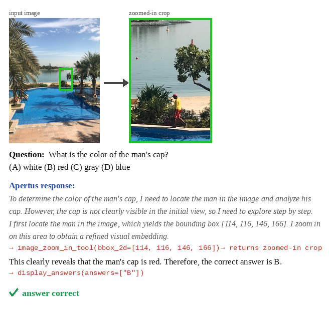
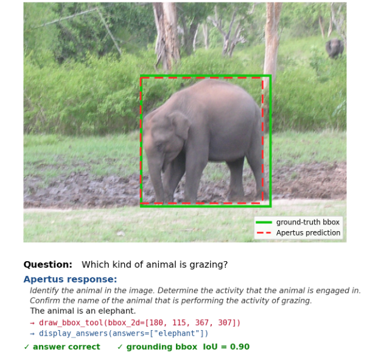

# verl-apertus

Tool-augmented visual reasoning for **Apertus 8B**, trained with [verl](https://github.com/volcengine/verl) (SFT + GRPO RL).

## Abstract

Apertus is a text-only LLM with **no vision encoder**: images enter as discrete IBQ tokens
(Emu3.5 `VisionTokenizer`) spliced into the prompt, so no off-the-shelf VLM training recipe
applies. This repo fills that gap with a vision **SFT → GRPO** pipeline for Apertus and uses it to
teach two visual tools:

- **VCoT (Visual-CoT)** — a *draw-bbox* **grounding** tool: the model localizes the referred region
  (scored by IoU), then answers. An **output** capability — the box is the deliverable. Evaluated on
  **RefCOCO+**. Trained first; its checkpoint initializes CoF.
- **CoF (Chain-of-Focus)** — an *image zoom-in* tool: the model crops a region of the *original*
  full-resolution image and re-encodes it at higher resolution before answering. An **input**
  capability — the crop feeds back into perception. Mirrors DeepEyes, adapted from Qwen-VL to Apertus,
  and **initialized from the VCoT grounding checkpoint** so it zooms the right region. Evaluated on
  **V\*Bench**.

The headline findings: RL sharpens *both* answering and grounding and transfers to RefCOCO+; and
initializing zoom-in from the grounding checkpoint is what makes zoom transfer to V\*Bench (a
base-initialized zoom policy zooms the wrong region and RL even regresses the score). A controlled
*no-magnification* crop is inert (real = noise), showing the zoom tool's value is **resolution, not
focus**.

Full write-up: [`report/report.tex`](report/report.tex).

## Repository layout

```
configs/        apertus*.yaml (eval + agent loop), cof_*.yaml, vcot_*.yaml (SFT/RL/tool configs)
data_prep/      download + parse into verl parquet schema (cof, vcot, vstar, refcocop)
tools/          the three verl tools below
rewards/        format-shaped GRPO rewards + eval rewards (cof_rl, vcot_rl, refcocop)
inference/      vision.py (IBQ encoder) + standalone HF eval harnesses
evaluation/     compute_accuracy.py
slurm/          one script per stage (prepare_* / *_sft / *_rl / eval_* / merge_*)
environment.yml pinned conda env (see "Environment setup")
report/         report.tex + figures (zoom_in.png, grounding_box.png)
plans/          design notes; viz/ plots; cluster.md cluster setup
```

## Example: input → output

The model reasons in text, calls a tool, and consumes the tool result before answering.

**Zoom-in (CoF, input capability).** A small region that occupied a handful of tokens in the
downsampled input gets *resolution gain* when re-encoded from the original image:



**Grounding-box (VCoT, output capability).** The emitted box (red) is scored by IoU against the gold
box (green), jointly with the answer:



## How Apertus "sees"

Apertus has **no continuous vision encoder**. Images are turned into discrete **IBQ tokens** by the
Emu3.5 `VisionTokenizer` (131k-entry codebook) and spliced into the text prompt as a token string
(`<|img_start|> … <|img_end|>`). See `inference/vision.py`.

The consequence: **verl treats Apertus as a text-only model.** A tool call doesn't return a PIL image
— it returns a *new IBQ token string*. The zoom tool crops the original full-resolution image and
re-encodes the crop; the bbox tool encodes the localized region. `smart_resize` clamps images to
`[16, 2048]` patches, but CoF crops are capped at a **256-token budget** at the call sites (the
`vision.py` default stays 2048 for other paths).

## Tools

| Tool | Pipeline | Returns |
|------|----------|---------|
| `image_zoom_in_emu_tool` | CoF | IBQ tokens of a cropped/zoomed region (`bbox_2d`) |
| `image_draw_bbox_tool`   | VCoT | acknowledges a localization bbox (`bbox_2d`) |
| `display_answers_tool`   | both | the answer-emission protocol (`answers: [...]`) |

The model emits Apertus-native calls: `<|tools_prefix|>[{"image_zoom_in_tool": {"bbox_2d": [...]}}]<|tools_suffix|>`.

## Reward shaping

Both RL rewards are format-shaped (max 1.0), so the policy is credited for *using the tool protocol
correctly*, not just for the final answer (Apertus could not produce well-formatted tool calls even
after SFT, so the format terms are essential):

- **CoF** (`rewards/cof_rl_reward.py`): `+0.1` valid zoom call · `+0.1` valid `display_answers` · `+0.9` answer match.
- **VCoT** (`rewards/vcot_rl_reward.py`): `+0.1` valid bbox call · `+0.1` valid `display_answers` · `+0.4` answer match · `+0.4` IoU with gold box.

## Environment setup

Everything runs on the **CSCS Clariden GH200 cluster** (aarch64 / ARM, 4× GH200 per node) under
SLURM + Enroot containers. See [`cluster.md`](cluster.md) for the full cluster guide.

**verl version.** Apertus is not supported by upstream verl. This repo requires the **patched fork**
at [`github.com/AlignedDragon/verl.apertus`](https://github.com/AlignedDragon/verl.apertus) (branch
`main`): **verl `0.8.0.dev`** Use exactly this fork — upstream verl on PyPI /
`volcengine/verl` will not run the Apertus format.

**1. Container.** Jobs run inside the Enroot `verl_env` container. Create `~/.edf/verl_env.toml`
pointing at the prebuilt image:

```toml
image = "/capstor/store/cscs/swissai/infra01/reasoning/imgs/projects/verl_swiss/image.sqsh"
mounts = ["/capstor", "/iopsstor", "/users"]
workdir = "/users/<user>/capscratch"

[annotations]
com.hooks.aws_ofi_nccl.enabled = "true"
com.hooks.aws_ofi_nccl.variant = "cuda12"
```

**2. Repos.** Clone the three source trees side by side under `$CAPSCRATCH` and put them on
`PYTHONPATH` (the SLURM scripts do this for you):

```bash
git clone git@github.com:AlignedDragon/verl.apertus.git verl   # patched fork, verl 0.8.0.dev @ 17ba85d2
# plus this repo (verl-apertus/) and Emu3.5/ (Emu3.5 source, provides the VisionTokenizer)
```

```
verl-apertus/   # this repo
verl/           # patched fork  -> github.com/AlignedDragon/verl.apertus (branch main)
Emu3.5/         # Emu3.5 source (provides the VisionTokenizer)
```

```bash
export PYTHONPATH="$PROJECT:$VERL:$EMU3_SRC:$PYTHONPATH"   # PROJECT=verl-apertus, VERL=verl, EMU3_SRC=Emu3.5/src
```

**3. Conda env.** All Python deps live in a conda env named `verl` (Python 3.12, CUDA 12.9,
aarch64). Create it from the tracked [`environment.yml`](environment.yml), which pins the exact
working versions:

```bash
# run this INSIDE the verl_env container — torch links against container libs (libmpi, NCCL)
# and will not import on a bare login node.
source <miniconda>/etc/profile.d/conda.sh          # miniconda that ships in the image
conda env create -f environment.yml                # creates env "verl"
conda activate verl

# then install the patched fork editable (do NOT `pip install verl` — that pulls upstream):
pip install -e ../verl
```

For subsequent jobs the SLURM scripts just re-activate it:

```bash
source <miniconda>/etc/profile.d/conda.sh
conda activate verl
```

> The `verl==0.8.0.dev0` line in `environment.yml` records the version for reproducibility, but the
> **source of truth is the fork at
> [`github.com/AlignedDragon/verl.apertus`](https://github.com/AlignedDragon/verl.apertus)**
> (`pip install -e ../verl`) — upstream verl on PyPI does not include the Apertus format patch.

**4. Model paths.** Base SFT checkpoint, Emu3.5 tokenizer and Emu3.5 source are set in
`configs/apertus.yaml` — point these at your local copies before running.

> Inside the container, `$SCRATCH = /iopsstor/scratch/cscs/$USER` — **hardcode
> absolute paths for HF caches**, don't rely on `$SCRATCH` resolving as it does on the login node.

## Workflow

Each stage has a script in `slurm/`, submitted with `--account infra01 --environment=verl_env`.
Typical CoF run:

```bash
# 1. data
sbatch slurm/prepare_cof_sft.slurm        # CoF-SFT-Data  -> parquet
sbatch slurm/prepare_cof_rl.slurm         # cof_rl (DeepEyes-derived) -> parquet

# 2. train  (CoF SFT initializes from the merged VCoT RL grounding checkpoint)
sbatch slurm/cof_sft.slurm                # SFT (>=3 epochs at the 256 budget)
sbatch slurm/cof_rl.slurm                 # GRPO (verl + sglang rollouts)
sbatch slurm/merge_cof_rl_checkpoint.slurm  # FSDP shards -> HF checkpoint

# 3. eval on V*Bench
sbatch slurm/prepare_vstar_eval.slurm
sbatch slurm/eval_vstar_verl.slurm        # MODEL=base|auto-sft|auto-rl   (sglang, authoritative)
```

The VCoT pipeline is symmetric: `prepare_vcot_{sft,rl}` → `vcot_sft` → `vcot_rl` →
`merge_vcot_rl_checkpoint` → `prepare_refcocop_eval` + `eval_refcocop_verl`.

> **Always evaluate under sglang, not HF.** HF greedy/sampling decoding degenerates on these
> checkpoints and badly under-reports tool use; verl's sglang engine is authoritative. When scoring
> the **base** model, score it from its free-text response — base never calls `display_answers`, so
> the tool-gated harness records 0% as an artifact, not an inability.

## Results (sglang, greedy)

The zoom-in policy is **initialized from the VCoT grounding checkpoint**, so it localizes the region
it zooms into.

**V\*Bench** — 191 MCQ, %:

| Model | 256-token budget |
|-------|:---:|
| base (direct)         | 33.0 |
| SFT + zoom (grnd-init) | 45.2 |
| RL + zoom (grnd-init)  | 49.3 |

**In-distribution** held-out cof_rl eval (408 Q): base **35.0** → SFT **54.4** → RL **64.9**.

**RefCOCO+** val, Acc@0.5 IoU: base **0.000** → SFT **0.274** → RL **0.309**.

Takeaways: the zoom tool **causally helps** (no-zoom ablations: +3pt at 256, +8pt at 2048). We first
train the VCoT grounding-box capability, then initialize the CoF zoom-in policy from that checkpoint.
This grounding init is what makes zoom transfer to V\*Bench: with a base-initialized policy the stock
GRPO reward left V\* flat and RL even regressed it (35.6 → 32.5), because the model zoomed the wrong
region; the grounding-initialized policy lifts both the CoF eval and V\*Bench (33.0 → 45.2 → 49.3)
and reverses that regression. RL at the 256 budget even beats the Apertus baseline at the full 2048
image-token budget (40.1).

## Conclusion

We built a vision SFT → RL pipeline for Apertus, a discrete-token VLM with no vision encoder, and used
it to add two visual tools. RL is unambiguously beneficial for the **grounding-box** capability: its
dense answer+IoU reward sharpens both answering and localization and transfers to RefCOCO+. Building
**zoom-in** on top of the grounding checkpoint closes the loop — a visual *input* tool helps only when
it supplies pixels the model could not already see, and re-encoding a crop of the original
full-resolution image does exactly that. The no-magnification control (focus but no new pixels) is
inert, refuting the implicit DeepEyes premise that a crop tool's value is focus rather than resolution.

## What's next

- **Tighten the grounding→zoom coupling.** A model that grounds better also zooms better, so improving
  grounding (better data, higher-IoU reward shaping) should directly lift zoom transfer.
- **More / composable tools.** Multi-crop and iterative zoom beyond the current two-crop cap; combine
  grounding and zoom in a single agent loop.
- **Broader evaluation.** Extend beyond RefCOCO+ / V\*Bench to more referring-expression and
  fine-detail VQA benchmarks.

## Status / caveats

- Inside the `verl_env` container, `$SCRATCH = /iopsstor/scratch/cscs/$USER` (not `/capstor/...`) — hardcode absolute paths for HF caches.
- 256-token SFT needs ≥2–3 epochs; 1 epoch degenerates the tool-call JSON.
- Requires the patched verl fork (`0.8.0.dev` @ `17ba85d2`); upstream verl will not run the Apertus format.
